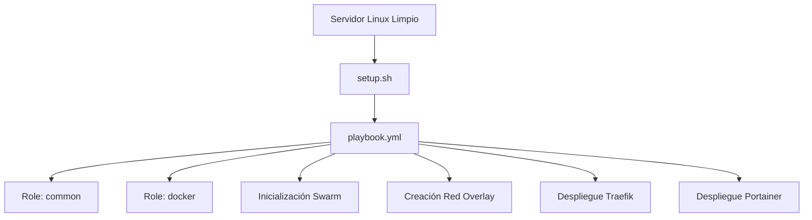

# 🚀 Syntalix-Orion

[](https://www.gnu.org/licenses/gpl-3.0)
[](https://docs.docker.com/engine/swarm/)
[](https://www.ansible.com/)
[](https://www.python.org/)

## Infraestructura como Código para despliegue automatizado y seguro de Docker Swarm con Ansible

**Syntalix-Orion** es una plataforma de **Infraestructura como Código (IaC)** diseñada para transformar un servidor Linux limpio en un entorno productivo basado en contenedores, utilizando automatización declarativa y principios de seguridad por diseño.

Permite instalar, configurar y desplegar automáticamente:

- 🐳 **Docker** - Runtime de contenedores
- 🔄 **Docker Swarm** - Orquestación de clúster
- 🔀 **Traefik** - Proxy reverso con routing dinámico + TLS
- 📊 **Portainer** - Gestión visual del clúster
- 📦 **Stacks personalizados** - Definidos en código

El proyecto está orientado a entornos DevOps, automatización omnicanal, microservicios y laboratorios reproducibles.

---

## 🎯 Objetivo

Proveer una base estandarizada, auditable, reproducible y escalable para:

| Caso de Uso | Descripción |
|-------------|-------------|
| 🏗️ Infraestructura de microservicios | Base modular para arquitecturas distribuidas |
| 📡 Plataformas omnicanal | Soporte para comunicación multi-canal |
| 🖥️ Entornos productivos ligeros | Despliegues eficientes y optimizados |
| 🔬 Laboratorios técnicos | Entornos reproducibles para pruebas |
| ⚙️ Fundamentos DevOps / SRE | Base para prácticas modernas de operaciones |

---

## 🧱 Stack Tecnológico

| Categoría | Tecnología | Función |
|-----------|------------|---------|
| 🔧 Automatización | Ansible | Orquestación declarativa |
| 🐳 Contenedores | Docker | Runtime de contenedores |
| 🔄 Orquestación | Docker Swarm | Cluster distribuido |
| 🔀 Proxy Reverso | Traefik | Routing dinámico + TLS |
| 📊 Gestión Visual | Portainer | Administración del clúster |
| 📝 Configuración | YAML | Definición declarativa |
| 🖥️ Scripts | Bash / Python | Bootstrap y lógica de negocio |

---

## 📐 Arquitectura General

### 🔹 Flujo de Automatización



### 🔹 Arquitectura Multi-Nodo

| Característica | Descripción |
|----------------|-------------|
| 🎛️ Nodo Manager | Controla el plano de orquestación |
| ⚙️ Workers | Ejecutan servicios distribuidos |
| 🔗 Comunicación interna | Mediante red overlay privada |
| ⚖️ Balanceo | Nativo gestionado por Swarm |
| 📈 Escalabilidad | Horizontal mediante réplicas |

---

## 🔐 Modelo de Seguridad – Defensa en Capas

### Seguridad por Diseño

| Principio | Implementación |
|-----------|----------------|
| 🚪 Puertos expuestos | Solo 80/443 al exterior |
| 🔒 Servicios internos | No publican puertos directamente |
| 🌐 Comunicación interna | Red overlay privada |
| 📦 Instalación mínima | Solo paquetes necesarios |
| 🔀 Separación | Plano de control vs plano de datos |
| 🛡️ Firewall | Preparado para UFW / iptables |
| 🔐 TLS | Preparado para certificados automáticos |

### 🔐 Gestión de Secretos

El proyecto está preparado para integrar:

- **Ansible Vault** para cifrado de:
  - Credenciales administrativas
  - Tokens API
  - Variables sensibles
- Separación de secretos por entorno (`dev` / `staging` / `prod`)

### 📋 Roadmap de Seguridad

- [ ] Implementación obligatoria de Ansible Vault
- [ ] Hardening automático de SSH
- [ ] Integración con gestor externo de secretos
- [ ] Auditoría automatizada de configuración
- [ ] Aplicación de benchmarks CIS

---

## 📂 Estructura del Proyecto

```text
.
├── setup.sh                # Script maestro de inicialización
├── uninstall.sh            # Script de desinstalación limpia
├── playbook.yml            # Orquestador principal de Ansible
├── aplicaciones.yml        # Definición de aplicaciones
├── inventory.ini           # Inventario de nodos
├── requirements.yml        # Dependencias de roles
├── ansible/                # Configuración de Ansible
│   └── roles/              # Roles personalizados
├── Orion-Python-Ansible/   # Núcleo de automatización
│   ├── ansible/            # Roles: common, docker, desplegador_aplicaciones
│   └── scripts/            # Lógica de negocio y wizard interactivo
├── aplicaciones.d/         # Definiciones de stacks por archivo
└── docs/                   # Documentación técnica detallada
```

### 🧩 Diseño Modular

| Principio | Descripción |
|-----------|-------------|
| 🔌 Roles desacoplados | Independencia entre componentes |
| 📊 Separación | Infraestructura base vs aplicaciones |
| 🔄 Idempotencia | Ejecuciones repetibles sin efectos secundarios |
| 📝 Declarativo | Configuración en YAML |
| ♻️ Reutilización | Componentes modulares |

---

## 🚀 Flujo Operativo


| Paso | Acción | Descripción |
|------|--------|-------------|
| 1 | Bootstrap inicial | `setup.sh` prepara el entorno |
| 2 | Instalación Docker | Runtime de contenedores |
| 3 | Inicialización Swarm | Clúster Docker Swarm |
| 4 | Creación red overlay | Red privada para servicios |
| 5 | Despliegue Traefik | Proxy reverso dinámico |
| 6 | Despliegue Portainer | Gestión visual |
| 7 | Despliegue de stacks | Aplicaciones definidas |

> **Nota:** El diseño es idempotente: puede ejecutarse múltiples veces sin romper el estado del sistema.

---

## 📦 Casos de Uso

| Caso | Descripción |
|------|-------------|
| 🏢 Plataforma omnicanal | Base para automatización de comunicaciones |
| 🐳 Microservicios | Infraestructura inicial escalable |
| 🔬 Laboratorios | Entornos reproducibles para pruebas |
| 🖥️ Producción ligera | Despliegues eficientes |
| 🔄 CI/CD | Base para integración continua |

---

## 📈 Escalabilidad

Syntalix-Orion permite:

| Capacidad | Descripción |
|-----------|-------------|
| ➕ Añadir nodos | Escalar el clúster horizontalmente |
| 📊 Escalar servicios | Réplicas bajo demanda |
| 🔄 Despliegue sin downtime | Actualizaciones continuas |
| 🔁 Reejecución segura | Playbooks idempotentes |
| 🏗️ Replicación | Entornos completos en nuevos servidores |

---

## 🏗️ Principios de Arquitectura

| Principio | Implementación |
|-----------|----------------|
| 📝 Infraestructura como Código | Todo definido en archivos de configuración |
| 🧩 Modularidad | Componentes independientes y reutilizables |
| 🔄 Reproducibilidad | Entornos idénticos en cualquier servidor |
| 🔐 Seguridad por defecto | Configuraciones seguras desde el inicio |
| ⚙️ Automatización total | Mínima intervención manual |
| 📊 Separación de responsabilidades | Roles y componentes bien definidos |
| 🏭 Producción ligera | Optimizado para recursos eficientes |

---

## 🔮 Roadmap Técnico

| Fase | Característica | Estado |
|------|----------------|--------|
| 📊 Monitoreo | Integración con Prometheus + Grafana | Planificado |
| 💾 Backup | Backup automatizado de configuraciones | Planificado |
| 🔐 Certificados | Gestión avanzada de certificados | Planificado |
| 🔄 CI/CD | Integración con pipelines | Planificado |
| 🛡️ SIEM | Integración con sistemas de seguridad | Planificado |
| 📝 Logs | Gestión centralizada de logs | Planificado |

---

## 🚀 Inicio Rápido

Para iniciar el despliegue de la infraestructura base, ejecute los siguientes comandos en un servidor limpio (Ubuntu/Debian):

```bash
# Clonar el repositorio
git clone https://github.com/franRestrpo/Syntalix-Orion.git
cd Syntalix-Orion

# Ejecutar el script de instalación
sudo ./setup.sh
```

> Para una guía detallada paso a paso, consulte la [Guía de Configuración y Despliegue](docs/CONFIG_DEPLOY.md).

---

## 📖 Documentación

| Documento | Descripción |
|-----------|-------------|
| 🛡️ [**Hardening & Seguridad**](docs/HARDENING.md) | Mejores prácticas y configuraciones de seguridad aplicadas |
| ⚙️ [**Guía de Despliegue**](docs/CONFIG_DEPLOY.md) | Configuración paso a paso y gestión de aplicaciones |
| 🛠️ [**Arquitectura Técnica**](docs/ARCHITECTURE.md) | Detalles internos sobre el motor de automatización |

---

## 🛠️ Soporte y Mantenimiento

Para asegurar un despliegue sin fricciones, hemos documentado las soluciones a los desafíos más comunes (redes, persistencia y comunicación de nodos).

👉 **[Consulta la Guía de Troubleshooting aquí](./docs/TROUBLESHOOTING.md)**

---

## 📜 Licencia

Este proyecto se distribuye bajo la licencia **GNU General Public License v3.0**. Consulte el archivo [LICENSE](LICENSE) para obtener más información.

---

## 📌 Conclusión

**Syntalix-Orion** es una plataforma de automatización de infraestructura diseñada para transformar servidores Linux en entornos Docker Swarm productivos mediante Ansible, aplicando principios de seguridad, modularidad y reproducibilidad.

No es un script aislado de instalación, sino una **base arquitectónica reutilizable** para despliegues modernos orientados a contenedores.

---

<p align="center">
  Desarrollado con ❤️ por <strong>Syntalix-Orion</strong>
</p>
