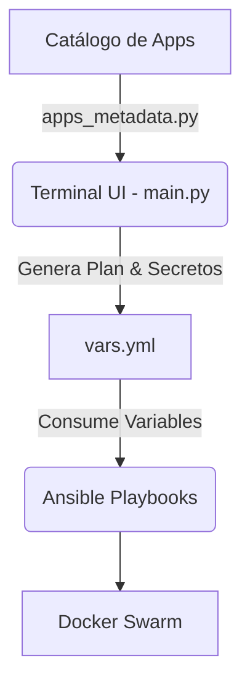

# 🚀 Syntalix-Orion

[](https://www.gnu.org/licenses/gpl-3.0)
[](https://docs.docker.com/engine/swarm/)
[](https://www.ansible.com/)
[](https://www.python.org/)

## Infraestructura como Código para despliegue automatizado y seguro de Docker Swarm con Ansible

**Syntalix-Orion** es una plataforma de **Infraestructura como Código (IaC)** diseñada para transformar un servidor Linux limpio en un entorno productivo basado en contenedores, utilizando automatización declarativa, interfaces de terminal guiadas (TUI) y principios de seguridad por diseño.

Permite instalar, configurar y desplegar automáticamente:

- 🐳 **Docker** - Runtime de contenedores
- 🔄 **Docker Swarm** - Orquestación de clúster
- 🔀 **Traefik** - Proxy reverso con routing dinámico + TLS
- 📊 **Portainer** - Gestión visual del clúster
- 📦 **Catálogo de Apps de Valor** - Stacks (Odoo, Flowise, Chatwoot, n8n, etc.) definidos y auto-configurados.

---

## 🎯 Objetivo

Proveer una base estandarizada, auditable, reproducible y escalable para:

| Caso de Uso | Descripción |
|-------------|-------------|
| 🏗️ Infraestructura de microservicios | Base modular para arquitecturas distribuidas |
| 📡 Plataformas omnicanal | Soporte para comunicación multi-canal |
| 🖥️ Entornos productivos ligeros | Despliegues eficientes y optimizados |
| 🔬 Laboratorios técnicos | Entornos reproducibles para pruebas |
| ⚙️ Fundamentos DevOps / SRE | Base para prácticas modernas de operaciones |

---

## 🧱 Stack Tecnológico

| Categoría | Tecnología | Función |
|-----------|------------|---------|
| 🔧 Automatización | Ansible | Orquestación declarativa (Roles) |
| 🐳 Contenedores | Docker | Runtime de contenedores |
| 🔄 Orquestación | Docker Swarm | Cluster distribuido |
| 🔀 Proxy Reverso | Traefik | Routing dinámico + TLS |
| 📊 Gestión Visual | Portainer | Administración del clúster |
| 💻 Terminal UI | Textual (Python) | Interfaz interactiva de planificación |
| 🖥️ Lógica / Grafo | Python | Resolución de dependencias y catálogo |

---

## 📐 Arquitectura V2 (Tres Capas)

Syntalix-Orion utiliza una arquitectura estructurada en 3 capas que separa los metadatos de la orquestación:

### 1️⃣ Capa de Metadatos (Fuente de Verdad)
- **`apps_metadata.py`**: El catálogo único de aplicaciones con sus dependencias (ej. `Postgres`, `Redis`, `MongoDB`) y consumo de RAM.

### 2️⃣ Capa de Presentación y Lógica (Textual UI)
- **`main.py`**: Interfaz de terminal que construye un grafo de dependencias, suma la memoria RAM requerida para el servidor y emite de manera segura las contraseñas globales unificadas en un único archivo de estado (`vars.yml` o `.env`).

### 3️⃣ Capa de Orquestación (Ansible)
- **Roles refactorizados**: Los roles de Ansible leen `vars.yml` (el estado generado por la TUI) y ejecutan la instalación del servidor, Docker Swarm y el despliegue final de los contenedores sin edición manual de YAMLs.


```mermaid
flowchart TD
    A[Catálogo de Apps] -->|apps_metadata.py| B(Terminal UI - main.py)
    B -->|Genera Plan & Secretos| C[vars.yml]
    C -->|Consume Variables| D(Ansible Playbooks)
    D --> E[Docker Swarm]
```

---

## 🔐 Modelo de Seguridad – Defensa en Capas

### Seguridad por Diseño

| Principio | Implementación |
|-----------|----------------|
| 🚪 Puertos expuestos | Solo 80/443 al exterior (vía Traefik) |
| 🔒 Servicios internos | No publican puertos directamente al host |
| 🌐 Comunicación interna | Red overlay privada (`public_proxy`) |
| 🔑 Deduplicación de Claves | Contraseña centralizada para DB (generada criptográficamente) |
| 🔀 Separación | Plano de control vs plano de datos |
| 🛡️ Firewall | Preparado para UFW / iptables |
| 🔐 TLS | Certificados automáticos con Traefik |

---

## 📂 Estructura del Proyecto

```text
.
├── main.py                 # Punto de entrada de la TUI interactiva
├── apps_metadata.py        # Fuente de verdad: Catálogo de apps y RAM
├── setup.sh                # Script de bootstrapping del servidor
├── site.yml                # Playbook maestro de Ansible
├── group_vars/all/vars.yml # Archivo consolidado de credenciales generado por la UI
├── ui/                     # Componentes de la interfaz de usuario (Textual)
├── engine/                 # Runners de Ansible desde Python
├── roles/                  # Roles de Ansible separados por capas:
│   ├── core/               # - Base del sistema y Docker
│   ├── data/               # - Bases de datos (Postgres, Mongo, etc.)
│   ├── monitoring/         # - Observabilidad y Portainer
│   └── apps/               # - Chatwoot, Evolution API, Odoo, etc.
├── tests/                  # Suite de pruebas unitarias
└── docs/                   # Documentación técnica detallada
```

---

## 🚀 Flujo Operativo

1. **Inicialización (Bootstrap):** Ejecute `setup.sh` en el servidor limpio para instalar las dependencias de Python y Ansible.
2. **Planificación:** Lance la TUI con `python main.py` para seleccionar los módulos de infraestructura y las aplicaciones a desplegar.
3. **Generación del Plan:** La UI resolverá las dependencias necesarias (ej. inyectar Postgres si seleccionó Chatwoot) y verificará los límites de RAM.
4. **Despliegue Automático:** Al confirmar, el Runner embebido de Ansible aplicará los cambios idempotentes sobre el clúster local de Docker Swarm.

---

## 📈 Escalabilidad

Syntalix-Orion permite:

| Capacidad | Descripción |
|-----------|-------------|
| ➕ Añadir nodos | Escalar el clúster horizontalmente |
| 📊 Escalar servicios | Réplicas bajo demanda |
| 🔄 Despliegue sin downtime | Actualizaciones continuas gestionadas por Swarm |
| 🔁 Reejecución segura | Playbooks idempotentes que leen de un mismo `vars.yml` |

---

## 🚀 Inicio Rápido

Para iniciar el despliegue de la infraestructura, clone el repositorio en su servidor (Ubuntu/Debian):

```bash
# Clonar el repositorio
git clone https://github.com/franRestrpo/Syntalix-Orion.git
cd Syntalix-Orion

# 1. Preparar el entorno (Ansible + Python)
sudo ./setup.sh

# 2. Iniciar el instalador visual interactivo
source venv/bin/activate
python main.py
```

-> Para una guía detallada paso a paso, consulte la [Guía de Configuración y Despliegue](docs/CONFIG_DEPLOY.md).

---

## 📖 Documentación

| Documento | Descripción |
|-----------|-------------|
| 🛡️ [**Hardening & Seguridad**](docs/HARDENING.md) | Mejores prácticas y configuraciones de seguridad aplicadas |
| ⚙️ [**Guía de Despliegue**](docs/CONFIG_DEPLOY.md) | Configuración paso a paso y gestión de aplicaciones |
| 🛠️ [**Arquitectura Técnica V2**](docs/V2_ARCHITECTURE.md) | Detalles de la nueva arquitectura de 3 capas |

---

## 🛠️ Soporte y Mantenimiento

Para asegurar un despliegue sin fricciones, hemos documentado las soluciones a los desafíos más comunes (redes, persistencia y comunicación de nodos).

👉 **[Consulta la Guía de Troubleshooting aquí](./docs/TROUBLESHOOTING.md)**

---

## 📜 Licencia

Este proyecto se distribuye bajo la licencia **GNU General Public License v3.0**. Consulte el archivo [LICENSE](LICENSE) para obtener más información.

---

<p align="center">
  Desarrollado con ❤️ por <strong>Syntalix-Orion</strong>
</p>