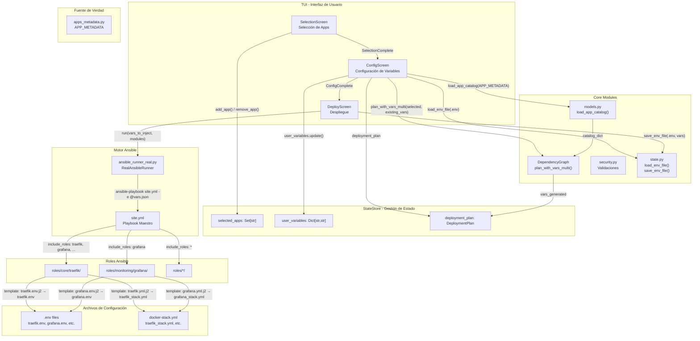
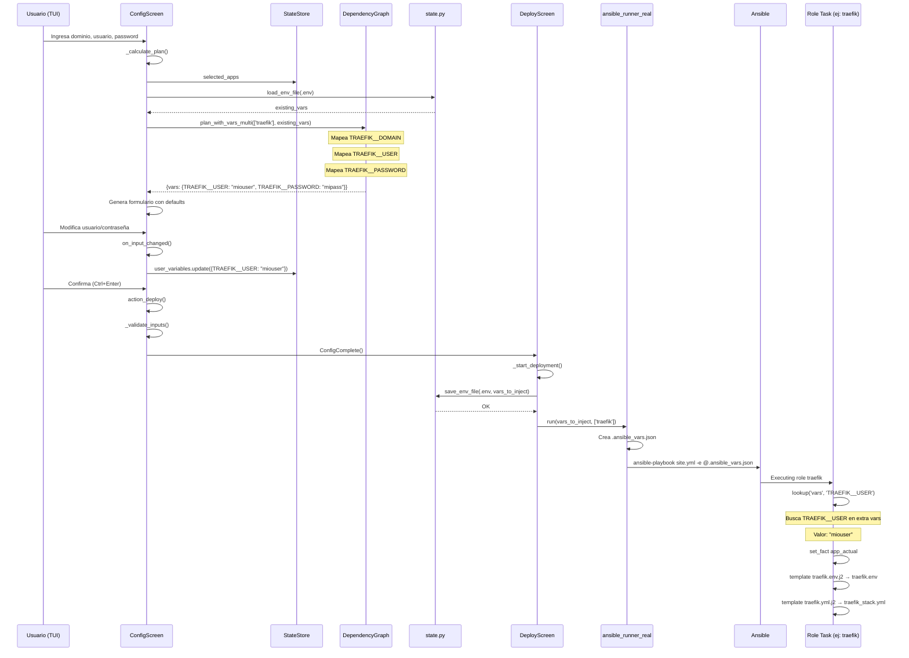
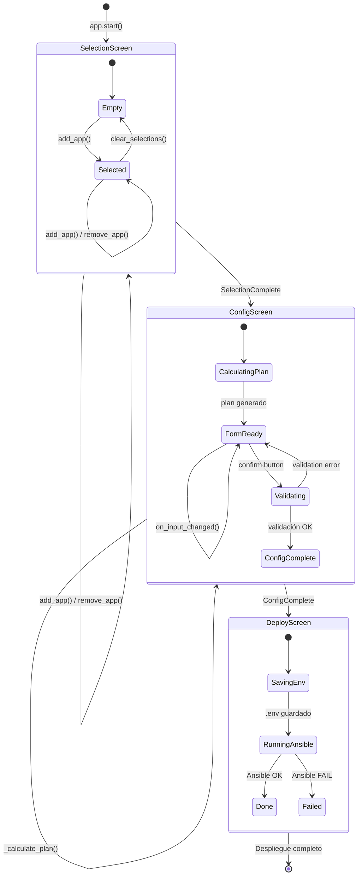
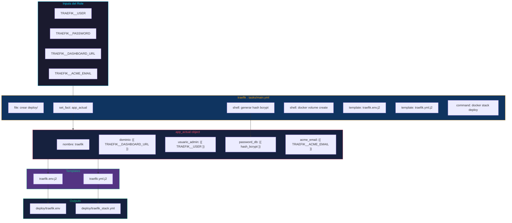
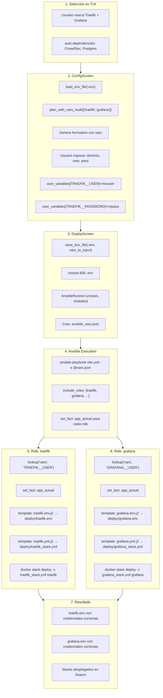
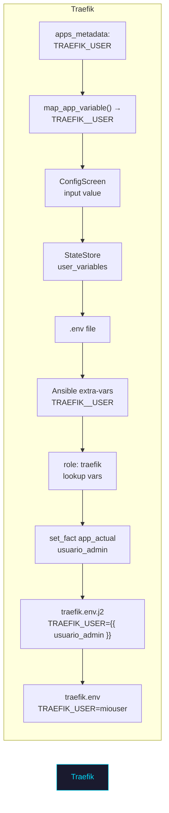
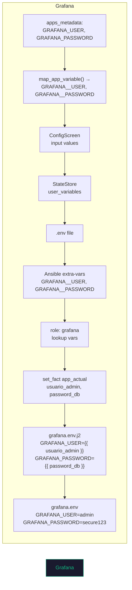

# Syntalix-Orion TUI - Diagramas de Flujo y Arquitectura

## 1. Arquitectura General del Sistema



---

## 2. Flujo Detallado: De TUI a Archivos .env



---

## 3. Flujo de Variables: Formato APPID__VARIABLE


---

## 4. Máquina de Estados - StateStore



---

## 5. Detalle del Role Ansible - Traefik



---

## 6. Template traefik.env.j2 - Renderizado

```mermaid
flowchart LR
    subgraph TEMPLATE["traefik.env.j2"]
        L1["INTERNAL_NETWORK=SyntalixNet"]
        L2["ACME_EMAIL={{ app_actual.acme_email }}"]
        L3["TRAEFIK_DASHBOARD_URL={{ app_actual.dominio }}"]
        L4["TRAEFIK_USER={{ app_actual.usuario_admin }}"]
        L5["TRAEFIK_PASSWORD={{ app_actual.password_db }}"]
    end

    subgraph CONTEXT["app_actual (desde set_fact)"]
        C1["acme_email: admin@test.com"]
        C2["dominio: traefik.test.com"]
        C3["usuario_admin: admin"]
        C4["password_db: $2b$12$hash..."]
    end

    subgraph RENDERED["traefik.env (resultado)"]
        R1["INTERNAL_NETWORK=SyntalixNet"]
        R2["ACME_EMAIL=admin@test.com"]
        R3["TRAEFIK_DASHBOARD_URL=traefik.test.com"]
        R4["TRAEFIK_USER=admin"]
        R5["TRAEFIK_PASSWORD=$2b$12$hash..."]
    end

    TEMPLATE + CONTEXT --> RENDERED
```

---

## 7. Flujo Completo: Selección → Despliegue



---

## 8. Mapa de Transformación de Variables





---

## Resumen de Archivos Clave

| Archivo | Propósito |
|---------|-----------|
| `apps_metadata.py` | Fuente de verdad - catálogo de apps y variables |
| `state_store.py` | Gestor de estado centralizado de la TUI |
| `dependency_graph.py` | Motor de resolución de dependencias y generación de vars |
| `config.py` | Pantalla de configuración - captura input del usuario |
| `deploy.py` | Pantalla de despliegue - ejecuta Ansible |
| `ansible_runner_real.py` | Ejecutor de Ansible via subprocess |
| `site.yml` | Playbook maestro que incluye roles |
| `roles/*/tasks/main.yml` | Tasks de cada role que hacen set_fact y template |
| `roles/*/templates/*.j2` | Templates Jinja2 que generan .env y docker-compose |